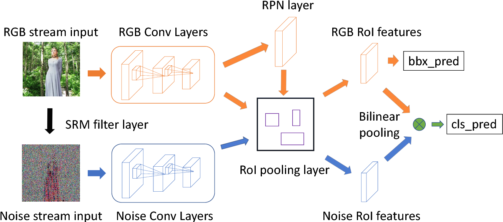
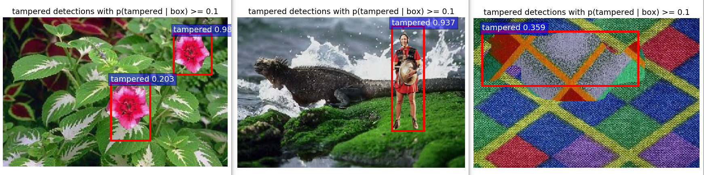

# Image_manipulation_detection
Paper: CVPR2018, [Learning Rich Features for Image Manipulation Detection](https://arxiv.org/pdf/1805.04953.pdf)  
Code based on [Faster-RCNN](https://github.com/dBeker/Faster-RCNN-TensorFlow-Python3.5)  

This is a rough implementation of the paper. Since I do not have a titan gpu, I made some modifications on the algorithm, but you can easily change them back if you want the exact setting from the paper.

# Environment
Python 3.6
TensorFlow 1.8.0

# Setup
- Download vgg16 pre-trained weights from [here](http://download.tensorflow.org/models/vgg_16_2016_08_28.tar.gz)
    - save to /data/imagenet_weights/vgg16.ckpt
- Two-stream neural network model: [lib/nets/vgg16.py](lib/nets/vgg16.py)
    - noise stream's weights are randomly initialized
    - for accurate prediction, please pre-train noise stream's vgg weights on `ImageNet` and overwrite the trainable setting of noise stream after `SRM` conv layer
- Bounding boxes are predicted by both streams.
    - In the paper, `RGB stream` alone predicts bbox more accurately, so you may wanna change that as well (also defined in vgg16.py)
- Use `main_create_training_set.py` to create training set from `PASCAL VOC` dataset.
    - The generated dataset will follow the `pascal voc` style, which is also required by `train.py`
- `Tensorboard` file will be save at `/default`
- Weights will be save to `/default/DIY_detaset/default`

# Note
The code requires a large memory GPU. If you do not have a 6G+ GPU, please reduce the number of noise stream conv layers for training.

# Demo results
Dataset size: 10000, epoch: 3

# Finally
I will update this repo a few weeks later after I installed the new GPU